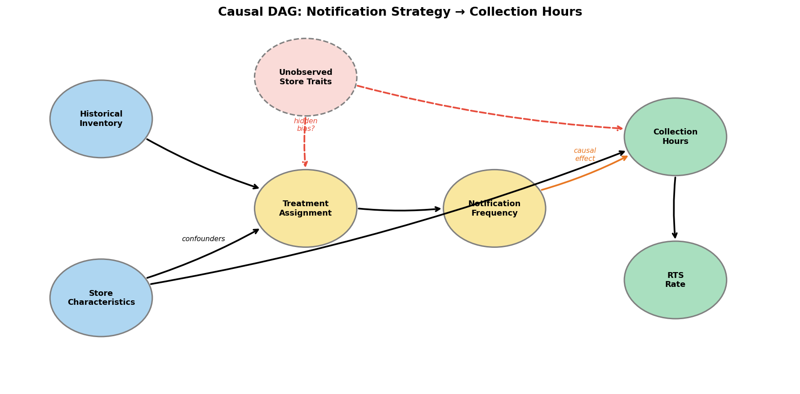
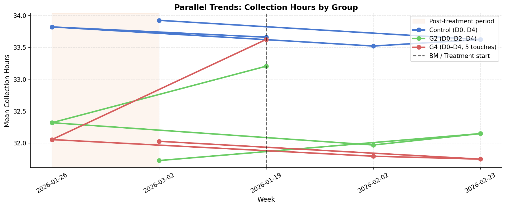
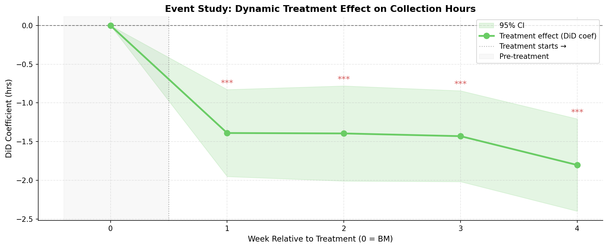
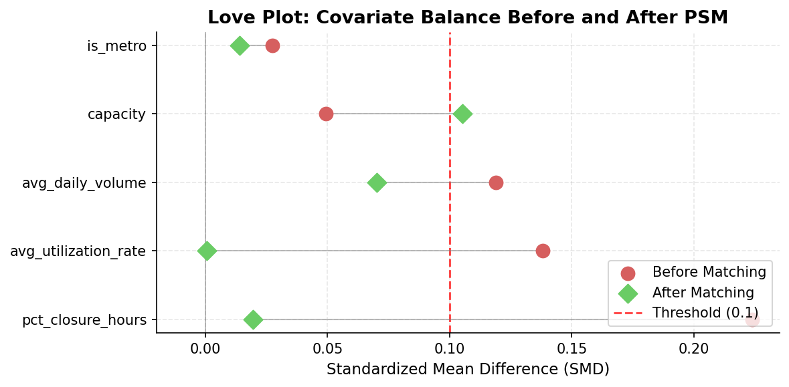
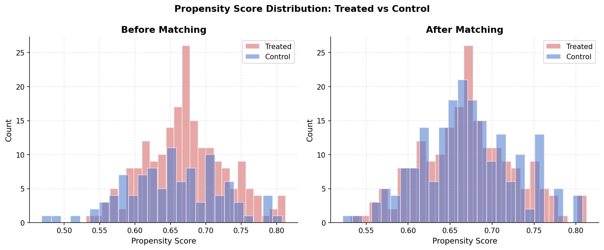
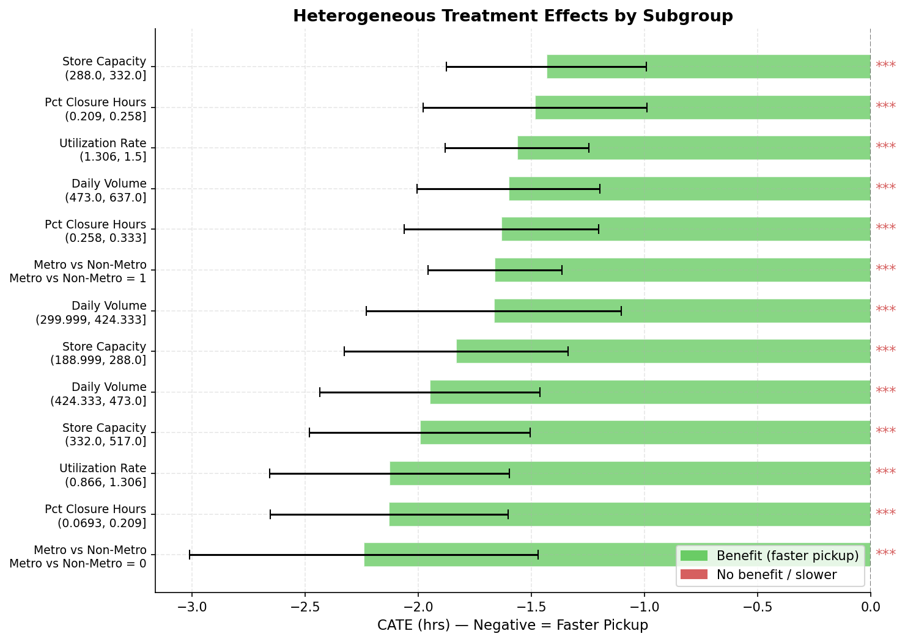
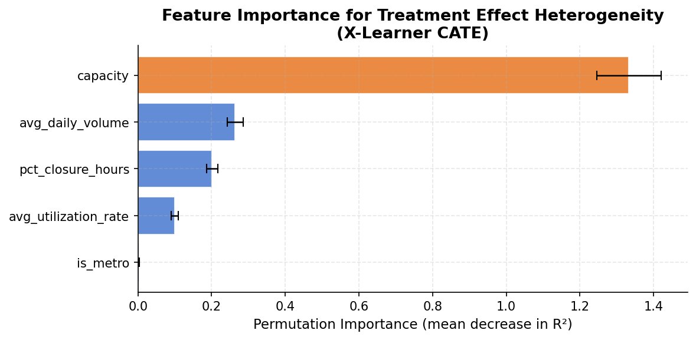
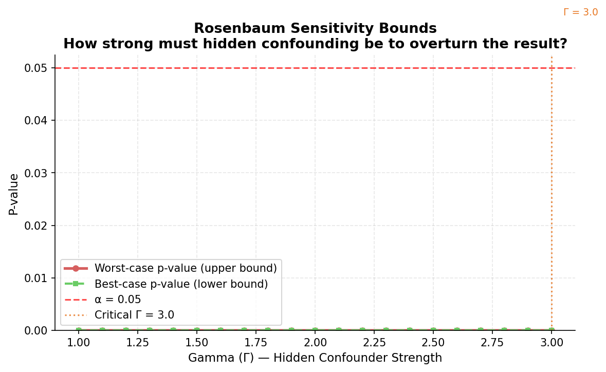

# 📦 How Many Notifications Should We Send?

### A Product Data Science Case Study — Notification Cadence & Locker Pickup Behavior

[](https://python.org)
[]()
[]()

---

## The Product Story

```
Buyers delay locker pickup
        ↓
Slots stay occupied → stores hit capacity ("burst")
        ↓
New parcels can't inbound → order pauses, RTS returns climb
        ↓
Network throughput and Next-Day Delivery reliability degrade
        ↓
Question: can push notifications fix this — and how many should we send?
```

**The decision on the table**: keep 2 notification touches per parcel, upgrade to 3, or go all-in with 5?

**The answer**:

> **Ship 3 touches, network-wide.** It cuts collection time by **~1.5 hours per parcel** and RTS returns by **~2,880 parcels/day**. Touches 4 and 5 add almost nothing but cost and opt-out risk. If rollout must be staged, start with **non-metro, high-capacity stores** — the effect there is 40% larger.

Everything below is how we know that's true, and not just a correlation.

---

## The Causal Question

Stores with more notification touches collect faster. But is that **because of the notifications** — or because those stores were different to begin with?

```
                Store Traits
        (traffic, capacity, inventory)
              ↙            ↘
   Notification Policy   Baseline Pickup Speed
              ↘            ↙
            Collection Time
                    ↑
          Holiday / Seasonality
```

Store traits drive **both** which policy a store gets **and** how fast its buyers pick up. Holidays shift pickup speed for everyone. Comparing raw averages mixes all of this together.

<p align="center"></p>

---

## Why This Method? (Not That One)

| Tempting shortcut | Why it fails here |
|---|---|
| **Just compare group means** | Burst stores are 84% metro; assignment is entangled with store traits. The naive gap (−1.75h) can't separate "notifications work" from "these stores were always faster." |
| **Regression with control variables** | Only adjusts for confounders you *thought to measure*. Anything unmeasured (staff behavior, local buyer demographics) still leaks in. |
| **"It's already an A/B test, just read the delta"** | Partly true — the three 5-day arms *were* randomized. But (a) the 6D arm was assigned by inventory level, not randomly, and (b) at n=100/arm, randomization is imperfect: G4 vs Control differed at baseline on closure hours (SMD 0.36) and capacity (SMD 0.26). |
| **✅ DiD (two-way fixed effects)** | Store fixed effects absorb **every** time-invariant store difference — measured or not. Week fixed effects absorb holidays and common shocks. What's left is the policy's causal effect. |
| **✅ PSM as a cross-check** | Rebuilds the comparison from a different direction: match each treated store to its statistical twin, *then* compare. If two methods with different assumptions agree, the effect is real. |

---

## Method 1 — Difference-in-Differences

**Identifying assumption**: absent the policy change, treated and control stores would have moved in parallel.

The pre-period levels sit together; the gap opens only after treatment starts:

<p align="center"></p>

The effect appears in week 1 and holds through week 4 — no ramp-up delay, no fade-out:

<p align="center"></p>

| Estimate | Effect | 95% CI | p |
|---|---|---|---|
| G2+G4 vs Control (two-way FE) | **−1.505h** | [−1.97, −1.04] | <0.001 |
| G2 (3 touches) vs Control | −1.228h | — | <0.001 |
| G4 (5 touches) vs Control | −1.782h | — | <0.001 |
| **Marginal value of touches 4–5** | **−0.555h** | — | — |

The 3rd touch does most of the work. Touches 4–5 buy half an hour for 3x the message volume.

---

## Method 2 — Propensity Score Matching (the cross-check)

**The concern**: small-sample randomization left the arms imbalanced on exactly the traits that predict pickup speed.

**The fix**: match each treated store to its most similar control store, then compare. Balance before vs. after:

<p align="center"></p>

<p align="center"></p>

All major covariates reach SMD < 0.1 after matching (99% of treated stores matched within caliper).

| Method | Effect | Agreement |
|---|---|---|
| DiD | −1.505h | — |
| PSM (ATT) | −1.654h | **within 9%** |

Two identification strategies, different assumptions, same answer. The PSM sample also shows **RTS rate −0.36pp** (95% CI [−0.38, −0.34]) — the tail-risk metric moves too.

---

## Where Should We Roll Out First?

Four independent CATE estimators (T/S/X-Learner, Causal Forest DML) agree the effect is real everywhere but **not uniform**:

<p align="center"></p>

| Segment | Effect | Priority |
|---|---|---|
| Non-metro stores | **−2.4h** | 🥇 First wave |
| High-capacity stores | Largest heterogeneity driver | 🥇 First wave |
| Metro stores | −1.7h | Second wave |
| Low-benefit tail | −0.2h (15 stores, 5%) | Deprioritize |

**What drives the difference?** Not geography — store **capacity** (feature importance 1.33, 5x the next variable; `is_metro` scores 0.003):

<p align="center"></p>

The operational read: big stores serve more buyers per notification wave and have more slots at risk when pickup stalls — each hour of faster collection unlocks more absolute capacity. **The stores where congestion hurts most are the stores where the fix works best.** The non-metro finding is the counter-intuitive bonus: buyers there have weaker baseline pickup habits, so a reminder moves them more.

---

## Can We Trust This? (Stress Tests)

| Test | Question | Verdict |
|---|---|---|
| Permutation (500 reshuffles) | Could chance produce −1.5h? | Never came close (p < 0.001) |
| Rosenbaum bounds | How strong must a hidden confounder be to kill the result? | **Γ ≥ 3.0** — double the conventional 1.5 robustness bar |
| Leave-one-week-out | Is one weird week carrying it? | Max shift 0.1h |
| Covariate stability | Does adding controls move the estimate? | 0.0% change across 7 specifications |
| Placebo outcomes | Effects where there shouldn't be? | Complaints/opt-outs rise < 0.001pp — the expected mechanical cost of sending more messages, not confounding |

<p align="center"></p>

---

## Business Recommendation

```
Ship the 3-touch cadence (D0, D2, D4)
        ↓
Stage rollout: non-metro + high-capacity burst stores first
        ↓
Expected per-parcel impact:   collection time  −1.5h
Expected network impact:      RTS returns      −0.36pp  (≈ 2,880 fewer/day at 800K volume)
                              locker turnover  ↑ (capacity freed ~1.5h earlier per slot cycle)
        ↓
Do NOT ship 5 touches: +0.3–0.6h benefit for 3x message cost
        ↓
Monitor guardrails at scale: complaint rate, opt-out rate
(small mechanical increase confirmed — set alert thresholds before full rollout)
```

**Metrics framework behind the decision:**

| Tier | Metric | Role in the decision |
|---|---|---|
| North Star | `collection_hrs` | The thing we're optimizing |
| Secondary | `rts_rate` | Tail-risk failure mode |
| Guardrails | `complaint_rate`, `opt_out_rate` | The cost we refuse to pay |

A cadence only "wins" if it moves the North Star without breaching guardrails. 3 touches does; 5 touches starts paying guardrail cost for negligible gain.

---

## Scaling Considerations: What Store-Level Randomization Buys — and What Could Still Bite

### Why cluster randomization (and what it costs)

Randomizing at the **store level** rather than buyer level was deliberate: notification policy is configured per locker location, and buyers at the same store share the physical queue — buyer-level randomization would put treated and control buyers in the same locker, contaminating both arms.

The cost: outcomes within a store are correlated (shared location, shared buyer pool), so the effective sample size is closer to **300 stores than 2.4M parcels**. All standard errors in this analysis are therefore **clustered at the store level** — the honest, conservative choice. This is also why per-arm n=100 leaves residual covariate imbalance (see PSM section).

### Interference channels this design does NOT close

| Channel | Mechanism | Direction of bias |
|---|---|---|
| **Multi-store buyers** | A buyer trained by 3-touch reminders at Store A carries the habit to control Store B | Dilutes the measured effect (conservative) |
| **Capacity spillover** | When a burst store closes ordering, volume reroutes to nearby stores; treated stores clearing faster absorb more overflow | Contaminates nearby controls; sign ambiguous |

**How I would test for spillover before full rollout**: compare control stores by distance to the nearest treated store. If near-controls behave differently from far-controls, SUTVA is violated and the next iteration should randomize at the **district level** instead.

### Rollout monitoring plan

1. **Long-term holdout**: keep ~5% of burst stores on 2-touch permanently — the only way to measure effect durability and detect drift
2. **Novelty check**: the event study already shows the effect is stable from week 1 through week 4 (no spike-then-fade) — re-verify at 12 weeks
3. **Guardrail alerts**: complaint and opt-out rates rose < 0.001pp in the pilot; set automated thresholds (e.g., 2x pilot level) before scaling
4. **Sequential monitoring**: staged rollout by wave (non-metro high-capacity first) with a pre-registered stopping rule if guardrails breach

---

## Experiment Design (Reference)

**Randomization unit**: store — notification policy is configured per locker location; store-level assignment prevents cross-contamination between buyers at one site.

```
1,000 burst stores (>5% order-closure hours) →

  Control │ 5-day deadline │ D0, D4        │ 2 touches │ n=100
  G2      │ 5-day deadline │ D0, D2, D4    │ 3 touches │ n=100
  G4      │ 5-day deadline │ D0–D4 daily   │ 5 touches │ n=100
  6D      │ 6-day deadline │ D0, D5        │ 2 touches │ n=700

1,000 vacant stores → 7D arm (comparison only)

Timeline: 1 baseline week + 4 treatment weeks
Excluded: Chinese New Year week (documented seasonal confound;
          leave-one-out confirms no single week drives the result)
```

Pilot sizing (100/100/100 vs 700) reflects the real constraint that full rollout wasn't feasible up front — pilot-then-scale is the standard compromise in operational experimentation.

**Data**: calibrated simulation. Real locker-network data is confidential; every parameter (baseline collection time, effect sizes, volume distributions, seasonality) is set to values observed in the real nationwide experiment. The data-generating process is fully documented in `src/data_generation.py` and `notebooks/01_Data_Preparation.ipynb` — which also means every estimator here is validated against known ground truth.

---

## Repository Guide

| You want... | Go to |
|---|---|
| The full statistical writeup (every table, every CI) | [**RESULTS.md**](RESULTS.md) |
| 中文完整說明（含名詞解釋） | [**RESULTS_zh.md**](RESULTS_zh.md) |
| The analysis, step by step | `notebooks/00–05` |
| Reusable estimator code | `src/` |

```bash
git clone https://github.com/Hanklin999/LockerCollectDesign
cd LockerCollectDesign
pip install -r requirements.txt
python src/data_generation.py
python -m jupytext --to notebook notebooks/*.py
jupyter notebook notebooks/     # run 01 → 00 → 02 → 03 → 04 → 05
```

---

## Limitations

- One pre-treatment week limits formal pre-trend testing — mitigated by baseline balance checks and the immediate, stable post-treatment effect
- Simulated data: the goal is demonstrating decision-grade experiment analysis, not a novel empirical discovery
- n=100/arm leaves residual imbalance after randomization — the explicit motivation for the PSM cross-check
- Guardrail metrics rise by < 0.001pp with more touches — operationally negligible, but set monitoring thresholds before scaling

---

## About

**Methods**: DiD (two-way FE) · PSM · T/S/X-Learner · Causal Forest DML · Rosenbaum bounds
**Tools**: Python · statsmodels · scikit-learn · matplotlib
**Background**: HarvardX Causal Inference (verified) · 2.5 years designing nationwide A/B experiments in e-commerce logistics

Built as a portfolio project for Product Data Scientist / Experimentation roles.

*Questions or feedback? Open an issue or reach out via [](https://.com/in/hank-lin-ch17).*
